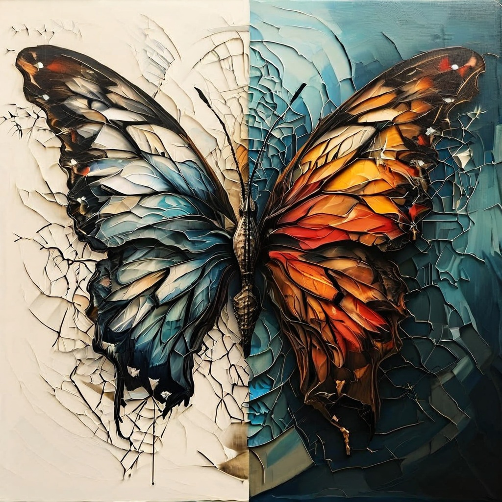

# PDF to Text and JSONL Converter

## Overview

This is a command line Python tool to convert larger PDF (and more types to come) files into the stages necessary for Ai to break down context and evaluate, re-evaluate and compare its own visual system with photo and text copy and then exhaustively create metadata the can be imported for fine tuning or vectorized or both.  

This project converts a PDF document into images, extracts text from those images using OCR (Optical Character Recognition), and then processes and formats the text using OpenAI's GPT model by comparing the image and text and creating metadata in a multimodal fashion. (the ai reviews the image and the text extracted by tesseract side by side) The final output is saved as both a formatted text file and a JSONL file with metadata.  

## I am currently tuning this project for gpt4o and gpt4o-mini and will be making updates all week. ***Stay Tuned***

## Features

- Convert PDF pages to images
- Extract text from images using Tesseract OCR
- Analyze Images and text, (side by side multimodal) and format meta-text with the help of OpenAI's GPT model
- Segment text into sections and save as JSONL with metadata



## Prerequisites

Before running the script, ensure you have the following installed:

- Python 3.6+
- Tesseract OCR
- Poppler-utils (for PDF to image conversion)
- Required Python packages (listed in requirements.txt)

## Installation

1. **Clone the repository:**

    ```sh
    git clone https://github.com/yourusername/pdf-to-text-jsonl.git
    cd pdf-to-text-jsonl
    ```

2. **Install dependencies:**

    ```sh
    pip install -r requirements.txt
    ```

3. **Set up Tesseract OCR:**

    - **Windows:** Download and install Tesseract from [here](https://github.com/tesseract-ocr/tesseract/wiki).
    - **macOS:** Install via Homebrew:

      ```sh
      brew install tesseract
      ```
    - **Linux:** Install via package manager:

      ```sh
      sudo apt-get install tesseract-ocr
      ```
4. **Set up Poppler-utils:**

    Windows: Download and install Poppler from here.

    macOS: Install via Homebrew:

    sh

    brew install poppler
    
    Linux: Install via package manager:
    
    sh

    sudo apt-get install poppler-utils

5. **Configure OpenAI API key:**

    Replace the placeholder API key in the script with your actual OpenAI API key.

    ```python
    client = OpenAI(api_key='your-api-key-here')
    ```

## Usage

1. **Place your PDF file:**

    Ensure your PDF file (e.g., `your_input_file.pdf`) is in the project directory.

2. **Run the script:**

    ```sh
    python main.py
    ```

    Follow the prompts to convert the PDF to images, extract text, analyze text, and segment text.
    The script will skip pipeline steps if it sees the files exist, simply move or delete the appropriate file (listed below under Output) to re-activate that step,
    (this feature allows for starting and stopping without starting over.)

## Script Details

- **convert_pdf_to_images(pdf_path, output_image_dir):** Converts each page of the PDF to an image.
- **extract_text_from_images(image_paths):** Extracts text from the generated images using Tesseract OCR.
- **analyze_and_format_text_with_images(text_chunks, image_paths):** Uses OpenAI's GPT model to analyze and format the extracted text.
- **segment_text_by_analysis(formatted_text):** Segments the formatted text into sections.
- **prepare_jsonl_data(segmented_text):** Prepares the segmented text for JSONL format.
- **save_text_to_file(text, file_path):** Saves text to a file.
- **save_jsonl_to_file(jsonl_data, file_path):** Saves JSONL data to a file.

## Output

- **Images:** Saved in the `output_images` directory.
- **Extracted Text:** Saved as `extracted_text.txt`.
- **Formatted Text:** Saved as `extracted_text_formatted.txt`.
- **JSONL Data:** Saved as `segmented_text.jsonl`.

## Example

Here's an example of how to run the script:

```sh
python main.py
```

You will be prompted to convert the PDF to images, extract text from images, analyze and format the text, and segment the text into JSONL format.

## Contributing

Feel free to fork this repository, make improvements, and submit pull requests. Contributions are welcome!

## License

This project is licensed under the MIT License. See the [LICENSE](LICENSE) file for details.

## Acknowledgements

- [OpenAI](https://www.openai.com/) for their GPT model.
- [Tesseract OCR](https://github.com/tesseract-ocr/tesseract) for the OCR engine.
- [pdf2image](https://github.com/Belval/pdf2image) for converting PDF to images.
- [Popplert-utils]([https://github.com/Belval/pdf2image](https://poppler.freedesktop.org/)) for converting PDF to images.

